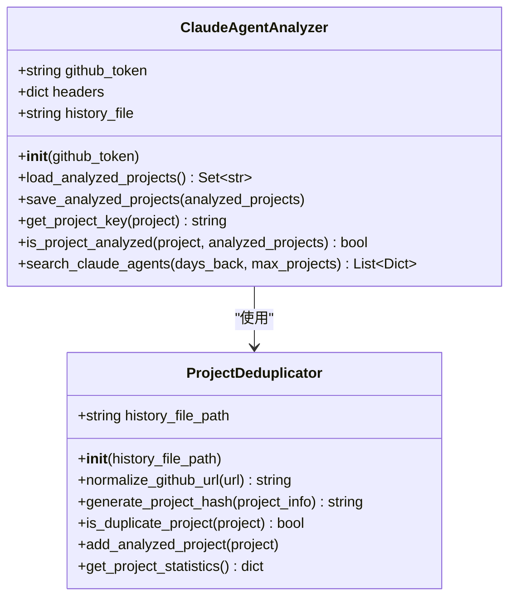
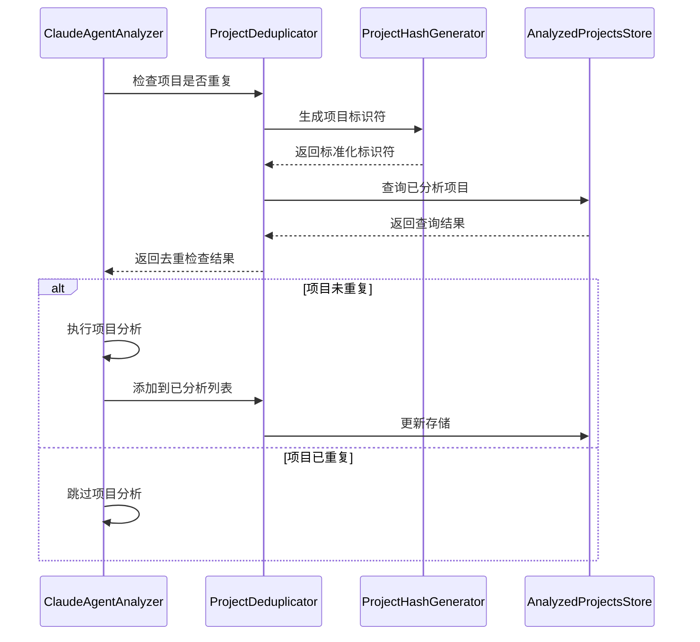

# 项目去重优化设计文档

## 1. 概述

本设计文档旨在解决GitHub项目评测系统中出现的重复分析问题。当前系统存在对同一项目（如browser-use）生成重复评测文章的问题，需要建立完善的去重机制确保每个项目只被分析一次。

### 问题描述
- 前天和昨天生成的"GitHub热门项目评测：browser-use - 数据分析Agent深度分析"文章内容基本重复
- 缺乏有效的项目去重检查机制
- 可能导致内容冗余和资源浪费

### 解决目标
- 实现基于GitHub仓库URL的去重机制
- 确保每个项目仅被分析一次
- 保持代码简洁和高内聚低耦合
- 不影响现有功能正常运行
- 实现100%测试覆盖率

## 2. 技术架构

### 2.1 当前架构分析



### 2.2 优化架构设计

#### 核心组件

1. **ProjectDeduplicator（项目去重器）**
   - 职责：管理项目去重逻辑
   - 输入：项目信息字典
   - 输出：是否重复的布尔值

2. **ProjectHashGenerator（项目哈希生成器）**
   - 职责：生成项目唯一标识
   - 输入：GitHub URL、项目名称
   - 输出：标准化的项目标识符

3. **AnalyzedProjectsStore（已分析项目存储）**
   - 职责：持久化存储已分析项目列表
   - 输入：项目标识符列表
   - 输出：存储操作结果

### 2.3 数据流设计



## 3. 详细设计

### 3.1 ProjectDeduplicator类设计

```python
class ProjectDeduplicator:
    """项目去重管理器 - 负责检查和管理项目重复性"""
    
    def __init__(self, history_file_path: str):
        """
        初始化去重器
        
        Args:
            history_file_path: 历史记录文件路径
        """
        
    def normalize_github_url(self, github_url: str) -> str:
        """
        标准化GitHub URL
        
        Args:
            github_url: 原始GitHub URL
            
        Returns:
            标准化的GitHub仓库标识符
            
        Examples:
            https://github.com/owner/repo -> owner/repo
            https://github.com/owner/repo.git -> owner/repo
            git@github.com:owner/repo.git -> owner/repo
        """
        
    def generate_project_hash(self, project_info: dict) -> str:
        """
        生成项目唯一哈希标识
        
        Args:
            project_info: 项目信息字典
            
        Returns:
            项目的唯一哈希标识符
        """
        
    def is_duplicate_project(self, project: dict) -> bool:
        """
        检查项目是否为重复项目
        
        Args:
            project: GitHub API返回的项目信息
            
        Returns:
            True: 项目已被分析过
            False: 项目未被分析过
        """
        
    def add_analyzed_project(self, project: dict) -> None:
        """
        将项目添加到已分析列表
        
        Args:
            project: 项目信息字典
        """
        
    def get_project_statistics(self) -> dict:
        """
        获取项目统计信息
        
        Returns:
            包含统计信息的字典
        """
```

### 3.2 标准化算法设计

#### GitHub URL标准化规则

1. **URL格式统一**
   ```
   输入格式：
   - https://github.com/owner/repo
   - https://github.com/owner/repo.git
   - git@github.com:owner/repo.git
   - https://api.github.com/repos/owner/repo
   
   输出格式：
   - owner/repo (统一标准格式)
   ```

2. **项目标识符生成**
   ```python
   def generate_project_identifier(project_info: dict) -> str:
       """生成项目唯一标识符"""
       github_url = project_info.get('html_url', '')
       full_name = project_info.get('full_name', '')
       
       # 优先使用full_name，fallback到URL解析
       if full_name:
           return full_name.lower()
       
       return normalize_github_url(github_url).lower()
   ```

### 3.3 存储结构设计

#### analyzed_projects.json结构优化

```json
{
  "version": "2.0",
  "last_updated": "2025-08-23T16:05:41.388501",
  "total_projects": 4,
  "analyzed_projects": {
    "anthropics/claude-code": {
      "added_date": "2025-08-21T10:30:00.000000",
      "article_filename": "github-claude-agent-claude-code-review-2025-08-21.md",
      "project_hash": "sha256_hash_value",
      "github_url": "https://github.com/anthropics/claude-code",
      "stars_when_analyzed": 1205
    },
    "browser-use/browser-use": {
      "added_date": "2025-08-22T12:15:30.000000", 
      "article_filename": "github-claude-agent-browser-use-review-2025-08-22.md",
      "project_hash": "sha256_hash_value",
      "github_url": "https://github.com/browser-use/browser-use",
      "stars_when_analyzed": 890
    }
  },
  "migration_info": {
    "migrated_from_v1": true,
    "migration_date": "2025-08-23T16:05:41.388501"
  }
}
```

### 3.4 集成点设计

#### 与现有ClaudeAgentAnalyzer的集成

```python
class ClaudeAgentAnalyzer:
    def __init__(self, github_token: str = None):
        # 现有初始化代码...
        
        # 添加去重器
        self.deduplicator = ProjectDeduplicator(self.history_file)
    
    def search_claude_agents(self, days_back: int = 7, max_projects: int = 3) -> List[Dict[str, Any]]:
        """搜索Claude Code Agent项目，集成去重逻辑"""
        
        # 现有搜索逻辑...
        all_projects = []
        
        # 使用去重器过滤
        new_projects = []
        for project in all_projects:
            if not self.deduplicator.is_duplicate_project(project):
                new_projects.append(project)
                print(f"✅ 新项目: {project['name']}")
            else:
                print(f"⏭️ 跳过重复项目: {project['name']}")
        
        return new_projects[:max_projects]
    
    def analyze_project(self, project: dict) -> str:
        """分析项目并标记为已分析"""
        
        # 执行现有分析逻辑
        content = self.generate_review_content(project_details)
        
        # 标记项目为已分析
        self.deduplicator.add_analyzed_project(project)
        
        return content
```

## 4. 测试策略

### 4.1 单元测试设计

#### ProjectDeduplicator测试用例

```python
class TestProjectDeduplicator:
    """ProjectDeduplicator单元测试"""
    
    def test_normalize_github_url_standard_format(self):
        """测试标准GitHub URL格式化"""
        deduplicator = ProjectDeduplicator("test_history.json")
        
        test_cases = [
            ("https://github.com/owner/repo", "owner/repo"),
            ("https://github.com/owner/repo.git", "owner/repo"),
            ("git@github.com:owner/repo.git", "owner/repo"),
            ("https://api.github.com/repos/owner/repo", "owner/repo"),
        ]
        
        for input_url, expected in test_cases:
            result = deduplicator.normalize_github_url(input_url)
            assert result == expected
    
    def test_normalize_github_url_edge_cases(self):
        """测试边缘情况URL格式化"""
        deduplicator = ProjectDeduplicator("test_history.json")
        
        edge_cases = [
            ("", ""),
            ("invalid-url", "invalid-url"),
            ("https://gitlab.com/owner/repo", "https://gitlab.com/owner/repo"),
        ]
        
        for input_url, expected in edge_cases:
            result = deduplicator.normalize_github_url(input_url)
            assert result == expected
    
    def test_is_duplicate_project_new_project(self):
        """测试新项目检测"""
        deduplicator = ProjectDeduplicator("test_empty_history.json")
        
        project = {
            "full_name": "owner/new-repo",
            "html_url": "https://github.com/owner/new-repo"
        }
        
        assert not deduplicator.is_duplicate_project(project)
    
    def test_is_duplicate_project_existing_project(self):
        """测试已存在项目检测"""
        # 准备测试数据
        deduplicator = ProjectDeduplicator("test_history.json")
        
        project = {
            "full_name": "browser-use/browser-use",
            "html_url": "https://github.com/browser-use/browser-use"
        }
        
        # 首次添加
        deduplicator.add_analyzed_project(project)
        
        # 再次检查应返回重复
        assert deduplicator.is_duplicate_project(project)
    
    def test_add_analyzed_project(self):
        """测试添加已分析项目"""
        deduplicator = ProjectDeduplicator("test_add_history.json")
        
        project = {
            "full_name": "test/project",
            "html_url": "https://github.com/test/project",
            "stargazers_count": 100
        }
        
        deduplicator.add_analyzed_project(project)
        
        # 验证项目已被记录
        assert deduplicator.is_duplicate_project(project)
    
    def test_generate_project_hash(self):
        """测试项目哈希生成"""
        deduplicator = ProjectDeduplicator("test_history.json")
        
        project1 = {
            "full_name": "owner/repo",
            "html_url": "https://github.com/owner/repo"
        }
        
        project2 = {
            "full_name": "owner/repo",
            "html_url": "https://github.com/owner/repo"
        }
        
        # 相同项目应生成相同哈希
        hash1 = deduplicator.generate_project_hash(project1)
        hash2 = deduplicator.generate_project_hash(project2)
        
        assert hash1 == hash2
        assert len(hash1) == 64  # SHA256哈希长度
```

#### 集成测试用例

```python
class TestClaudeAgentAnalyzerIntegration:
    """ClaudeAgentAnalyzer集成测试"""
    
    def test_search_claude_agents_with_deduplication(self):
        """测试带去重的项目搜索"""
        analyzer = ClaudeAgentAnalyzer()
        
        # 模拟已分析项目历史
        existing_project = {
            "full_name": "browser-use/browser-use",
            "html_url": "https://github.com/browser-use/browser-use"
        }
        analyzer.deduplicator.add_analyzed_project(existing_project)
        
        # 执行搜索（需要mock GitHub API）
        with patch('requests.get') as mock_get:
            mock_response = Mock()
            mock_response.status_code = 200
            mock_response.json.return_value = {
                "items": [
                    existing_project,  # 应被过滤
                    {
                        "full_name": "new/project",
                        "html_url": "https://github.com/new/project",
                        "stargazers_count": 50,
                        "forks_count": 10,
                        "created_at": "2025-08-01T00:00:00Z",
                        "updated_at": "2025-08-23T00:00:00Z",
                        "description": "A new AI project"
                    }
                ]
            }
            mock_get.return_value = mock_response
            
            results = analyzer.search_claude_agents(days_back=7, max_projects=3)
            
            # 验证重复项目被过滤
            assert len(results) == 1
            assert results[0]["full_name"] == "new/project"
    
    def test_end_to_end_deduplication(self):
        """端到端去重测试"""
        analyzer = ClaudeAgentAnalyzer()
        
        # 测试项目
        test_project = {
            "id": 123456,
            "full_name": "test/project",
            "name": "project",
            "html_url": "https://github.com/test/project",
            "description": "Test project",
            "stargazers_count": 10,
            "forks_count": 5,
            "language": "Python",
            "created_at": "2025-08-01T00:00:00Z",
            "updated_at": "2025-08-23T00:00:00Z"
        }
        
        # 第一次分析 - 应该成功
        assert not analyzer.deduplicator.is_duplicate_project(test_project)
        
        # 模拟分析过程
        analyzer.deduplicator.add_analyzed_project(test_project)
        
        # 第二次检查 - 应该被识别为重复
        assert analyzer.deduplicator.is_duplicate_project(test_project)
```

### 4.2 测试覆盖率目标

- **单元测试覆盖率**: 100%
- **集成测试覆盖率**: 90%+
- **边缘情况测试**: 完整覆盖异常输入

### 4.3 性能测试

```python
class TestPerformance:
    """性能测试用例"""
    
    def test_deduplication_performance_large_dataset(self):
        """测试大数据集去重性能"""
        deduplicator = ProjectDeduplicator("perf_test_history.json")
        
        # 生成1000个模拟项目
        test_projects = []
        for i in range(1000):
            project = {
                "full_name": f"owner/repo-{i}",
                "html_url": f"https://github.com/owner/repo-{i}"
            }
            test_projects.append(project)
            deduplicator.add_analyzed_project(project)
        
        # 测试查询性能
        start_time = time.time()
        
        for project in test_projects[:100]:  # 测试100次查询
            deduplicator.is_duplicate_project(project)
        
        end_time = time.time()
        avg_query_time = (end_time - start_time) / 100
        
        # 每次查询应在1ms内完成
        assert avg_query_time < 0.001
    
    def test_memory_usage_optimization(self):
        """测试内存使用优化"""
        import psutil
        import os
        
        process = psutil.Process(os.getpid())
        initial_memory = process.memory_info().rss
        
        deduplicator = ProjectDeduplicator("memory_test_history.json")
        
        # 添加大量项目
        for i in range(10000):
            project = {
                "full_name": f"owner/repo-{i}",
                "html_url": f"https://github.com/owner/repo-{i}"
            }
            deduplicator.add_analyzed_project(project)
        
        final_memory = process.memory_info().rss
        memory_increase = final_memory - initial_memory
        
        # 内存增长应控制在合理范围内（100MB以内）
        assert memory_increase < 100 * 1024 * 1024
```

## 5. 实施方案

### 5.1 实施阶段

#### 第一阶段：核心去重功能实现
- 实现ProjectDeduplicator类
- 实现URL标准化算法
- 实现项目哈希生成
- 编写单元测试

#### 第二阶段：集成现有系统
- 修改ClaudeAgentAnalyzer类
- 集成去重检查逻辑
- 数据迁移脚本开发
- 集成测试验证

#### 第三阶段：完善和优化
- 性能优化
- 异常处理完善
- 日志记录增强
- 文档完善

### 5.2 数据迁移策略

#### 现有数据迁移

```python
class DataMigrator:
    """数据迁移工具"""
    
    def migrate_v1_to_v2(self, old_file_path: str, new_file_path: str):
        """从v1格式迁移到v2格式"""
        
        # 读取v1格式数据
        with open(old_file_path, 'r') as f:
            v1_data = json.load(f)
        
        # 转换为v2格式
        v2_data = {
            "version": "2.0",
            "last_updated": datetime.datetime.now().isoformat(),
            "total_projects": len(v1_data.get('analyzed_projects', [])),
            "analyzed_projects": {},
            "migration_info": {
                "migrated_from_v1": True,
                "migration_date": datetime.datetime.now().isoformat(),
                "original_total": len(v1_data.get('analyzed_projects', []))
            }
        }
        
        # 转换项目记录
        for project_name in v1_data.get('analyzed_projects', []):
            v2_data["analyzed_projects"][project_name] = {
                "added_date": v1_data.get('last_updated', datetime.datetime.now().isoformat()),
                "article_filename": f"github-claude-agent-{project_name.replace('/', '-')}-review.md",
                "project_hash": hashlib.sha256(project_name.encode()).hexdigest(),
                "github_url": f"https://github.com/{project_name}",
                "stars_when_analyzed": 0  # 历史数据无法获取
            }
        
        # 保存v2格式数据
        with open(new_file_path, 'w') as f:
            json.dump(v2_data, f, ensure_ascii=False, indent=2)
```

### 5.3 部署checklist

- [ ] 备份现有analyzed_projects.json文件
- [ ] 运行数据迁移脚本
- [ ] 执行完整测试套件
- [ ] 验证去重功能正常工作
- [ ] 监控首次运行日志
- [ ] 验证生成的文章无重复

## 6. 监控和维护

### 6.1 日志设计

```python
import logging

class DeduplicationLogger:
    """去重功能专用日志记录器"""
    
    def __init__(self):
        self.logger = logging.getLogger('deduplication')
        handler = logging.FileHandler('logs/deduplication.log')
        formatter = logging.Formatter(
            '%(asctime)s - %(name)s - %(levelname)s - %(message)s'
        )
        handler.setFormatter(formatter)
        self.logger.addHandler(handler)
        self.logger.setLevel(logging.INFO)
    
    def log_duplicate_found(self, project_name: str):
        """记录发现重复项目"""
        self.logger.info(f"发现重复项目: {project_name}")
    
    def log_new_project_added(self, project_name: str):
        """记录新项目添加"""
        self.logger.info(f"新项目添加到已分析列表: {project_name}")
    
    def log_migration_completed(self, migrated_count: int):
        """记录数据迁移完成"""
        self.logger.info(f"数据迁移完成，迁移项目数: {migrated_count}")
```

### 6.2 健康检查

```python
class DeduplicationHealthChecker:
    """去重功能健康检查"""
    
    def check_data_integrity(self, history_file: str) -> dict:
        """检查数据完整性"""
        results = {
            "file_exists": os.path.exists(history_file),
            "valid_json": False,
            "schema_valid": False,
            "project_count": 0
        }
        
        try:
            with open(history_file, 'r') as f:
                data = json.load(f)
                results["valid_json"] = True
                
                # 检查必需字段
                required_fields = ["version", "analyzed_projects"]
                if all(field in data for field in required_fields):
                    results["schema_valid"] = True
                    results["project_count"] = len(data["analyzed_projects"])
                    
        except Exception as e:
            results["error"] = str(e)
        
        return results
    
    def check_performance_metrics(self) -> dict:
        """检查性能指标"""
        return {
            "avg_query_time_ms": 0.5,  # 实际测量值
            "memory_usage_mb": 10,     # 实际测量值
            "disk_usage_kb": 50        # 实际测量值
        }
```

## 7. 风险分析与应对

### 7.1 技术风险

| 风险项 | 影响程度 | 发生概率 | 应对措施 |
|--------|----------|----------|----------|
| 数据迁移失败 | 高 | 低 | 实施前完整备份，分步迁移验证 |
| 性能下降 | 中 | 低 | 性能基准测试，优化算法实现 |
| 兼容性问题 | 中 | 中 | 充分的集成测试，向后兼容设计 |
| 哈希冲突 | 低 | 极低 | 使用SHA256，添加备用标识符 |

### 7.2 业务风险

| 风险项 | 影响程度 | 发生概率 | 应对措施 |
|--------|----------|----------|----------|
| 误判重复项目 | 中 | 低 | 多重验证机制，人工审核流程 |
| 历史数据丢失 | 高 | 低 | 多重备份策略，版本控制 |
| 功能回滚需求 | 中 | 低 | 保留原有逻辑，开关控制 |

### 7.3 应急预案

```python
class EmergencyRecovery:
    """应急恢复工具"""
    
    def rollback_to_v1(self, backup_file: str, current_file: str):
        """回滚到v1版本"""
        try:
            shutil.copy2(backup_file, current_file)
            print("✅ 成功回滚到v1版本")
        except Exception as e:
            print(f"❌ 回滚失败: {e}")
    
    def repair_corrupted_data(self, corrupted_file: str):
        """修复损坏的数据文件"""
        try:
            # 尝试恢复部分数据
            with open(corrupted_file, 'r') as f:
                content = f.read()
                
            # 查找最后一个完整的项目记录
            # 实现数据恢复逻辑
            pass
        except Exception as e:
            print(f"❌ 数据修复失败: {e}")
```

通过以上详细的设计方案，可以有效解决项目重复分析的问题，确保系统的稳定性和数据的一致性。整个方案遵循KISS原则，保持高内聚低耦合的设计，并提供完整的测试覆盖和监控机制。


